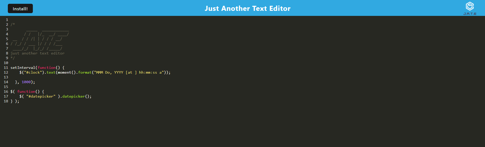

<h1 align="center">Jon Kelly's JATE - Just Another Text Editor's ReadMe</h1>

## About The Project
A progressive web app that is just another text editor that can be downloaded and used offline. The text is saved in a database so that your work is automatically saved as soon as your done typing it.

Link to repo - [https://github.com/J0nK-LE/challenge19](https://github.com/J0nK-LE/challenge19)

Link to deployed  - [https://macabre-shadow-79010.herokuapp.com/](https://macabre-shadow-79010.herokuapp.com/)

[![License][ISC-bdg]][ISC-url]

## Table of Contents

Table of Contents

     <ol>
       <li><a href="#about-the-project">About The Project</a></li>
       <li><a href="#installation">Installation</a></li>
       <li><a href="#usage">Usage</a></li>
       <li><a href="#license">License</a></li>
       <li><a href="#tests">Tests</a></li>
       <li><a href="#questions">Questions</a></li>
     </ol>

## Installation
use "npm start" in the command line at the root and it will begin to run. Then go to "http://localhost:3000/" in your browser. You can download the page using the install button in the top left corner, allowing for offline usage.
## Usage
to edit text
## License
[![License][ISC-bdg]][ISC-url]
## Questions

GitHub - [https://github.com/J0nK-LE](https://github.com/J0nK-LE)

[MIT-bdg]:https://img.shields.io/badge/License-MIT-yellow.svg
[MIT-url]:https://opensource.org/licenses/MIT
[Apache-bdg]:https://img.shields.io/badge/License-Apache_2.0-blue.svg
[Apache-url]:https://opensource.org/licenses/Apache-2.0
[GNU-bdg]:https://img.shields.io/badge/License-GPLv3-blue.svg
[GNU-url]:https://www.gnu.org/licenses/gpl-3.0
[IBM-bdg]:https://img.shields.io/badge/License-IPL_1.0-blue.svg
[IBM-url]:https://opensource.org/licenses/IPL-1.0
[ISC-bdg]:https://img.shields.io/badge/License-ISC-blue.svg
[ISC-url]:https://opensource.org/licenses/ISC
[Mozilla-bdg]:https://img.shields.io/badge/License-MPL_2.0-brightgreen.svg
[Mozilla-url]:https://opensource.org/licenses/MPL-2.0
